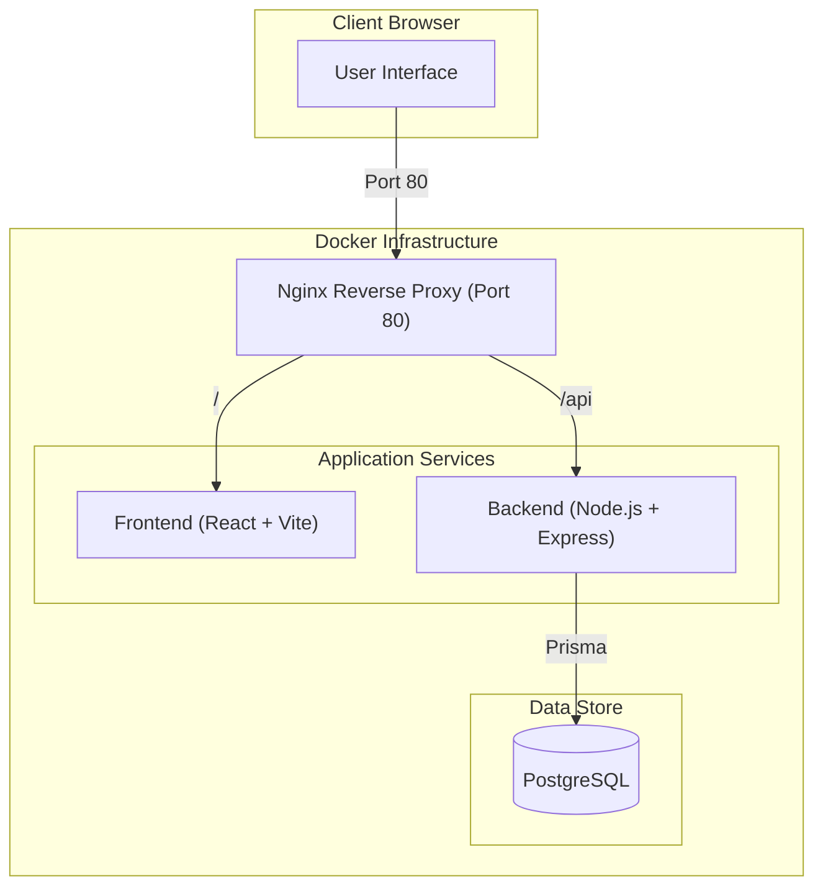

# Claw Kanban Board – Monorepo Architecture

## Overview
A modern mono-repo for a Kanban board service inspired by Jira.

### Goals
- Mono-repo structure for frontend & backend
- Jira-like Kanban UI 
- Frontend: ReactJS + TypeScript (styled like JIRA)
- Backend: Node.js + TypeScript (+ Express or similar)
- Persistent storage: PostgreSQL DB with Prisma ORM
- API contracts between FE/BE
- Dockerized deployment with Nginx reverse proxy
- End-to-end testing with Playwright
- Package management with pnpm

## Directory Structure

```
claw-dev-board/
├── backend/      # Node.js + TypeScript server, REST APIs, connects to Postgres
│   ├── Dockerfile
│   └── README.md
├── frontend/     # ReactJS + TypeScript SPA
│   ├── Dockerfile
│   ├── nginx.conf
│   └── README.md
├── e2e/          # End-to-end test suite (Playwright)
├── docker-compose.yml # Consolidated environment orchestration
├── playwright.config.ts
├── README.md     # Project overview
└── SPEC.md       # Architecture & requirements (this file)
```

## Backend
- Node.js with TypeScript (Express.js for REST endpoints)
- Prisma ORM for PostgreSQL connection and migrations
- Data models: Board, Column, Ticket, User
- API routes for CRUD: Users, Boards, Tickets
- Seed script for development initialization

## Database (Postgres + Prisma)
- Persistent backend storage
- Develop using Docker Compose Postgres
- Migration managed by Prisma (schema.prisma)

## Frontend
- React 19 + TypeScript (Vite)
- State management: React Hooks
- UI Library: Tailwind CSS (styling targets Jira aesthetic)
- Drag & Drop: `@hello-pangea/dnd`
- API Client: Axios with base URL handling

## Infrastructure
- **Consolidated Docker:** Root-level `docker-compose.yml` orchestrates the DB, Backend, and Frontend.
- **Reverse Proxy:** Nginx serves the frontend and proxies `/api/*` requests to the backend service.

## Architecture Diagram



## Status & Progress
- [x] Initial infrastructure and monorepo setup
- [x] Backend core (User/Board/Ticket CRUD)
- [x] Frontend core (Layout & Kanban Board rendering)
- [x] Kanban Logic (Drag & Drop, Ticket creation)
- [x] Dockerization & Reverse Proxy implementation
- [x] E2E Testing suite setup
- [ ] Authentication & Authorization (Next Phase)
- [ ] Ticket detail editing modal
