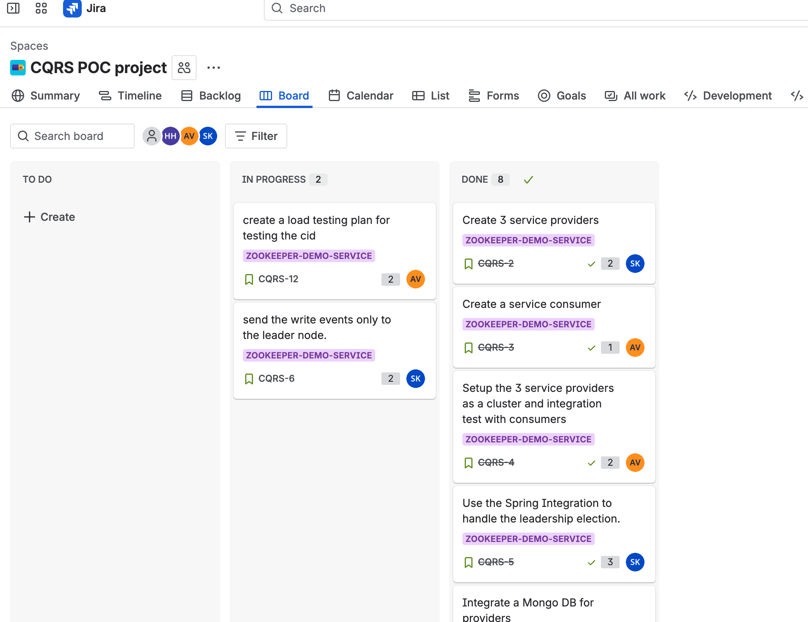
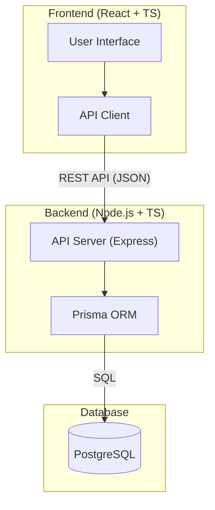

# Claw Kanban Board – Monorepo Architecture

## Overview
A modern mono-repo for a Kanban board service inspired by Jira.

### Goals
- Mono-repo structure for frontend & backend
- Jira-like Kanban UI 
- Frontend: ReactJS + TypeScript (styled like JIRA)
- Backend: Node.js + TypeScript (+ Express or similar)
- Persistent storage: PostgreSQL DB with Prisma ORM
- API contracts between FE/BE

## Directory Structure

```
claw-dev-board/
├── backend/      # Node.js + TypeScript server, REST APIs, connects to Postgres
│   ├── docker-compose.yml
│   └── README.md
├── frontend/     # ReactJS + TypeScript SPA
│   └── README.md
├── README.md     # Project overview
└── SPEC.md       # Architecture & requirements (this file)
```

## Backend
- Node.js with TypeScript (use Express.js for REST endpoints)
- Prisma ORM for PostgreSQL connection and migrations
- Data models: Board, Column, Ticket, User
- API routes for CRUD and Kanban logic
- Docker Compose setup for dev Postgres

## Database (Postgres + Prisma)
- Persistent backend storage
- Develop using Docker Compose Postgres
- Migration managed by Prisma (schema.prisma)

## Getting Started (Backend)
- Clone repo
- Run `docker-compose up -d` in ./backend to start Postgres
- Install backend deps: `npm install`
- Configure .env (see backend/README.md)
- Use `npx prisma migrate/dev` for schema management

## Future Considerations
- Auth (JWT, Passport.js, or similar)
- Dockerization/devops setup (prod-ready)
- Unit/end-to-end testing frameworks

## Architecture Diagram



